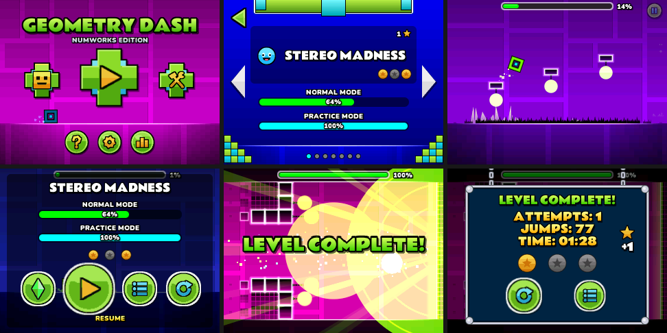

# NumDash

A Geometry Dash recreation for NumWorks calculators, built as a native `.nwa` app for the N0120 (320 × 240, STM32H7).

It plays the first seven official levels (**Stereo Madness**, **Back on Track**, **Polargeist**, **Dry Out**, **Base After Base**, **Can't Let Go** and **Jumper**) with their original object layouts, colour changes and secret coins, using the Geometry Dash 2.x cube and ship physics. The menus, pause screen, level-complete sequence and editor are laid out after the original game.



## Install

1. Download **`NumDash.nwa`** from the [latest release](https://github.com/mason363/numdash/releases/latest).
2. Connect the calculator by USB and open the [NumWorks app manager](https://my.numworks.com/apps).
3. Upload `NumDash.nwa`, then open **NumDash** from the calculator's home screen.

The app is native code, not a Python script. It needs a firmware that accepts third-party apps (the N0120 with official Epsilon does).

## Controls

| Where | Key | Action |
| --- | --- | --- |
| Everywhere | Arrows, OK or EXE, Back | Move, select, go back |
| Everywhere | Home | Save and quit |
| Playing | OK, EXE or Up | Jump; hold to keep jumping or to fly the ship; tap on an orb |
| Playing | Back | Pause (resume, practice mode, level select, restart) |
| Practice mode | 0 / Backspace | Place / remove a checkpoint |
| Main menu | Back | Quit dialog |
| Editor | Arrows, OK | Move the cursor, use the current tool |
| Editor | 0 | Build / Edit / Delete |
| Editor | + − or Toolbox | Next / previous object |
| Editor | Shift, x,n,t | Rotate the brush, copy the object under the cursor |
| Editor | Alpha, Backspace | Undo, delete |
| Editor | Var, ln, EXE, Back | Save, level settings, playtest, save and exit |

## What is recreated

- **Physics**: the 2.x cube and ship at 240 steps per second, with the original gravity, jump, pad, orb, portal and speed constants, buffered jumps, ceiling rules and the end-of-level fly-in. Every built-in level is verified completable by a recorded input replay in `tests/replays/`.
- **Levels**: object positions, rotations, colour triggers, fade-in effects and secret coins come from the official level exports (see [`levels/manifest.json`](levels/manifest.json) for sources and hashes).
- **Look**: the scrolling background and ground, block glow, pulsing orbs and rods, portals, particles, circle effects, the player trail, the "Attempt N" label, the progress bar and percentage.
- **Screens**: main menu with the icon running across it and the colour cycle; level select pages with difficulty faces, stars, coins and progress bars; pause menu; "New Best!" popup; the level-complete light rays, rings, fireworks and the window that drops in on chains; practice mode with checkpoints; icon kit colours; settings, stats and how-to-play popups; a "My Levels" list and an editor.

All artwork is drawn procedurally by the scripts in `tools/` in the style of the original; no files from the game are included. Text uses two SIL Open Font License typefaces (Rammetto One and Nunito), see [`LICENSES`](LICENSES). NumWorks apps cannot play sound, so there is no music; objects pulse to each level's tempo instead.

## Saves

Progress, settings and icon colours live in one 192-byte record, `numdash.nds`; each custom level has its own record, `numdash1.ndl` to `numdash3.ndl` (about 5 bytes per object). Epsilon keeps a pointer to the record it read last, so NumDash never moves another record: it rewrites its own records in place, appends new ones, and only resizes a record that is the last one in storage. Saves from the previous NumDash release (`numdash.ndd`) are converted on first launch.

## Performance

The screen is rendered in 24-line strips straight to the LCD (15 KB of buffer instead of a 150 KB framebuffer), and strips that did not change are not sent. Physics runs at a fixed 240 Hz independent of the frame rate, and short key presses made while a frame is being sent are still registered. When a frame fits in the LCD refresh, the app waits for the vertical blank to avoid tearing. The app uses about 115 KB of RAM and 165 KB of flash. Counted on an ARM emulator, a gameplay frame takes about 2 million instructions, the menus about 4.5 million and the busiest moment of the level-complete sequence about 7 million, which leaves room for 40 frames per second on the N0120. The **Low detail** setting removes decorations and glow.

## Build

Requirements: `make`, `arm-none-eabi-gcc`, Node.js (for `nwlink`), and SDL2 for the desktop version.

```sh
npm ci
make build check     # build/numdash.nwa, linked and checked with nwlink
make test            # unit tests, app flow tests and the seven level replays
make run             # desktop version (arrows, Space/Enter to jump, Esc = Back)
```

The generated sources (`src/assets.c`, `src/leveldata.c`, `src/objdefs.c`) are checked in. `make assets` and `make levels` regenerate them (Python 3 with numpy and Pillow; the fonts are downloaded and verified by hash). `make epsilon-app` builds `build/numdash.nwb` for the official Epsilon simulator (`epsilon.bin --nwb build/numdash.nwb`), and `./build/tests --shots DIR` renders every screen to images.

## Credits

Geometry Dash is made by RobTop Games; NumDash is an unofficial fan project and is not affiliated with it. Physics constants and level data were researched from [gd3ds](https://github.com/AleFunky/gd3ds) by AleFunky and contributors, a Geometry Dash recreation for the 3DS. Fonts: Rammetto One (The Rammetto Project Authors) and Nunito (The Nunito Project Authors), both under the SIL Open Font License 1.1.
