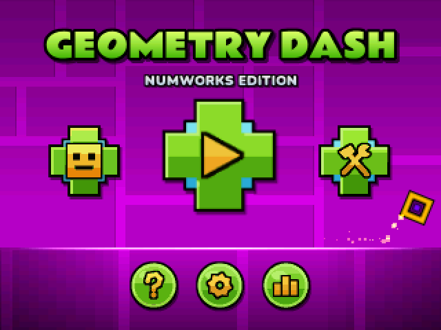
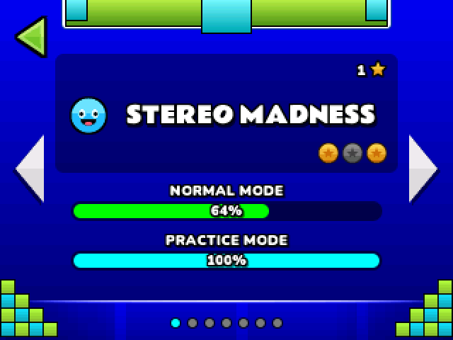
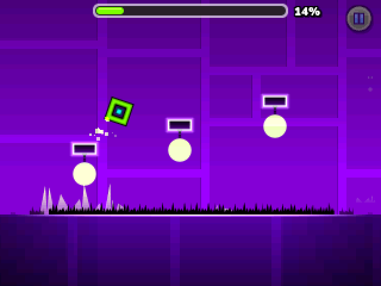
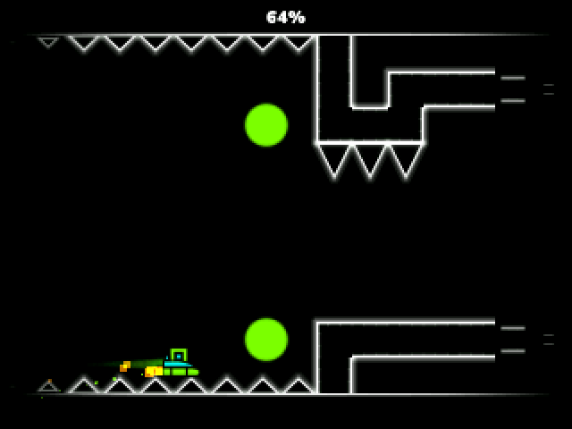
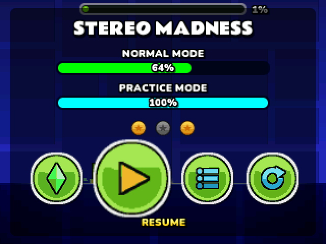
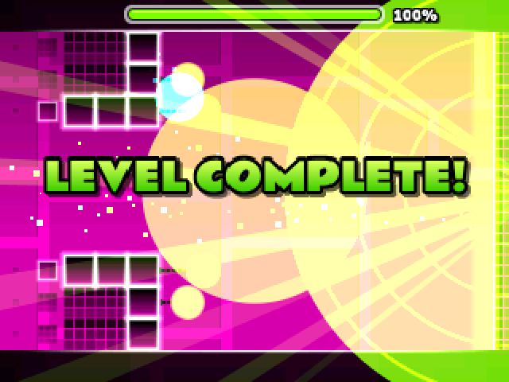
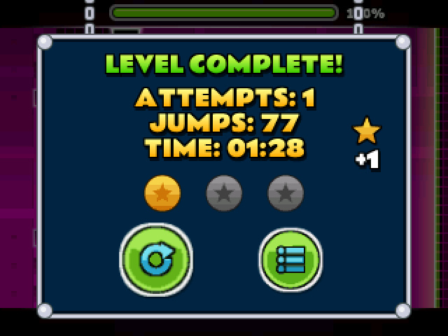
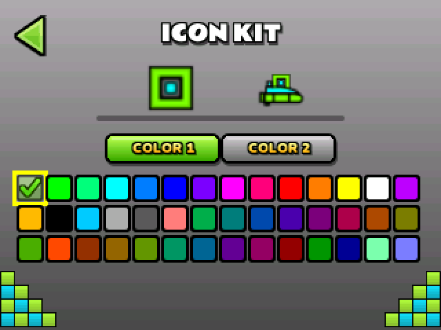
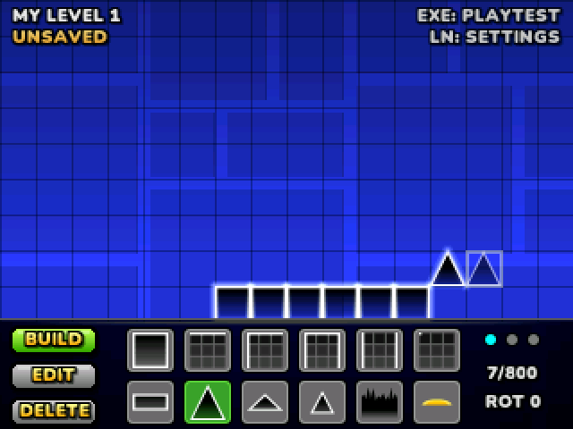

# NumDash

**Geometry Dash on your NumWorks calculator.**

NumDash is a fan-made version of Geometry Dash that runs right on a NumWorks graphing calculator. Jump over spikes, fly the ship, collect secret coins and try to beat the first seven levels of the real game, all with the calculator's keys.

### [⬇ Download NumDash.nwa](https://github.com/Mason363/NumDash/releases/latest/download/NumDash.nwa)



## How to install it

You only need the calculator, its USB cable and a computer with Chrome or Edge.

1. **Download** [NumDash.nwa](https://github.com/Mason363/NumDash/releases/latest/download/NumDash.nwa) (the button above).
2. **Plug** your calculator into the computer with the USB cable.
3. **Open** [my.numworks.com/apps](https://my.numworks.com/apps) and follow the steps to send the file to your calculator.
4. **Play:** on the calculator, press the Home key and open **NumDash**.

That's it. Your progress is saved on the calculator, so you can close the game and come back later.

> NumDash is made for the **NumWorks N0120** (the newest model). The website above tells you which model you have.

## What's inside

### The real levels

Stereo Madness, Back on Track, Polargeist, Dry Out, Base After Base, Can't Let Go and Jumper, with the same obstacles, colour changes and 3 hidden coins in each one.

 

### It plays like the original

The jump, the gravity, the ship and every pad and orb behave like they do in Geometry Dash, so the timing you already know works here too.

 

### Practice mode

Pause the game and pick the green diamond to practice. Press **0** to drop a checkpoint and you'll restart from there instead of from the beginning.

### The level complete moment

Beat a level and you get the light rays, the fireworks, the big "Level Complete!" and your stats, just like the game.

 

### Make it yours

Pick your icon colours in the icon kit, change settings like the progress bar or low detail mode, and build your own levels in the level editor (3 save slots).

 

## Controls

| Key | What it does |
| --- | --- |
| **OK**, **EXE** or **Up** | Jump. Hold it to keep jumping, or to fly up in the ship |
| **Back** | Pause the game, or go back in menus |
| **Arrows** | Move around the menus |
| **0** | Place a checkpoint (in practice mode) |
| **Backspace** | Remove your last checkpoint |
| **Home** | Save and quit |

The **?** button on the main menu shows these again, plus the level editor keys.

## Good to know

- **There is no music.** NumWorks calculators have no speaker. Objects still pulse to the beat of each song.
- **Your old progress is kept.** If you played an older version of NumDash, your progress on the first four levels and your custom levels carry over.
- **It won't mess with your other files.** NumDash saves into a few small files of its own and never touches your Python scripts or anything else.
- NumDash is a free fan project. It is not made by or connected to RobTop Games, who make Geometry Dash. All the graphics were redrawn from scratch to look like the game.

## Thanks

- **RobTop Games** for Geometry Dash.
- **[gd3ds](https://github.com/AleFunky/gd3ds)** by AleFunky and friends, a Geometry Dash remake for the Nintendo 3DS, whose research into how the game works made this possible.
- The **Rammetto One** and **Nunito** fonts, both free under the SIL Open Font License (see the [LICENSES](LICENSES) folder).

## For developers

You need `make`, `arm-none-eabi-gcc`, Node.js and, for the desktop version, SDL2.

```sh
npm ci
make build check   # builds build/numdash.nwa
make test          # tests, level replays and random-input tests
make run           # desktop version (arrow keys, Space to jump, Esc to go back)
```

`make assets` and `make levels` rebuild the graphics and level data (Python 3 with numpy and Pillow). Changing the `VERSION` file on `main` publishes a new release automatically.
